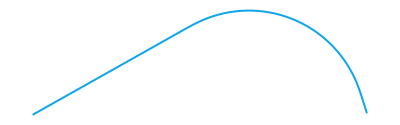
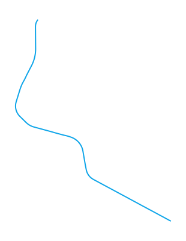

# allure-wkt

© 2026 J.P.J. Bloemscheer / JeroenTechSolutions — Licensed under [EUPL-1.2](LICENSE.txt)

Preprocessor CLI for Allure reports that converts Well-Known Text (WKT) geometry attachments into high-quality SVG visualizations.

<p align="center">
  
</p>

<p align="center">
  <em>What allure-wkt produces from a single <code>COMPOUNDCURVE (..., CLOTHOID (...), CIRCULARSTRING (...), CLOTHOID (...), ...)</code> attachment — a real ProRail rail-bend (track 823_12V_4.3, EPSG:28992) rendered as one continuous SVG polyline. <a href="docs/hero-shot.wkt">Source WKT</a>.</em>
</p>

## Why this exists

When your tests produce WKT geometries (e.g. LINESTRINGs from GIS, road alignment, computational geometry, or map rendering tests), raw WKT text in the Allure Attachments tab is hard to interpret.

`allure-wkt` automatically:

1. Scans your `allure-results/` directory
2. Finds attachments with WKT MIME type or `.wkt` extension
3. Parses the geometry, computes a tight bounding box, and renders a clean, zoomable SVG
4. Writes the SVG next to the original attachment
5. **Patches the `*-result.json`** so the SVG appears as a first-class attachment in the test detail view — exactly where you expect it.

The SVG shows up in the **Attachments tab** (or as an attachment step) in every Allure frontend (Awesome, Classic, future versions) with zero changes to your test code or CI beyond one extra command.

## Usage

```bash
# After your tests have written allure-results/
npx allure-wkt allure-results/

# Then generate the report as usual
npx allure generate allure-results/ -o allure-report/
# or
npx allure serve allure-results/
```

In CI (example for GitHub Actions / Jenkins / GitLab):

```yaml
- run: npx allure-wkt allure-results/
- run: npx allure generate allure-results/ --clean -o allure-report
- uses: actions/upload-artifact@v4
  with:
    name: allure-report
    path: allure-report/
```

## v1 supported geometries

- POINT
- LINESTRING (≥ 2 points)
- TRIANGLE (3 corners + closing repeat, per OGC)
- TIN (≥ 1 triangle)
- CIRCULARSTRING (odd count ≥ 3; chain of circular arcs)
- COMPOUNDCURVE — chain of LINESTRING / CIRCULARSTRING / **CLOTHOID** members; renders as a single continuous polyline with shared junctions deduped
- **CLOTHOID** *(extension; only valid as a non-leading COMPOUNDCURVE member, per the [grammars-v4 proposal](https://github.com/antlr/grammars-v4/pull/4848))* — Euler / Cornu spiral; densified via Simpson integrator ported from the JTS reference

POLYGON-with-holes / MULTI* / GEOMETRYCOLLECTION ship additively as the parser/renderer grow. See `CLOTHOID_PROPOSAL.md` for design notes on the curve types.

## Stretch goal: the entire ProRail Sigma dataset

`examples/prorail/` ships a converter + gallery generator that runs the
**full Dutch national rail alignment dataset** (≈ 122k analytical track
elements, **9,058 of them clothoids**, grouped into **11,495 trajectories**)
through this exact preprocessor — no special-case code paths, no hand-tuning.

| Trajectory | Elements | Rendered SVG |
|---|---:|---|
| `504_13BR_17.1` | 149 |  |
| `467_011L_102.0` | 18 |  |
| `011_39A/39B_S_T_68.8` | 5 |  |
| `536_225B/233A_S_T_60.7` | 3 |  |

Reproduce locally (~minutes for the full network):

```sh
npx tsx examples/prorail/fetch-and-convert.ts --all --out /tmp/prorail-all
npx tsx src/index.ts /tmp/prorail-all
npx tsx examples/prorail/build-gallery.ts --in /tmp/prorail-all --out /tmp/prorail-gallery
open /tmp/prorail-gallery/index.html
```

Source data: [ProRail Spoorgeometrie](https://maps.prorail.nl/arcgis/rest/services/Spoorgeometrie/FeatureServer/11) (CC BY 4.0). See [`examples/prorail/README.md`](examples/prorail/README.md) for the field-by-field WKT mapping.

## How it works (architecture)

- Pure post-processor on the stable `allure-results/` format (no dependency on `@allurereport/plugin-api` or any specific writer).
- Walks every `*-result.json`, inspects `attachments[]` (and nested step attachments).
- For matching WKT attachments, reads the source file, renders SVG, writes `<uuid>-attachment.svg`.
- Appends a new entry to the `attachments` array with `type: "image/svg+xml"`.
- The Allure reader + frontend then treats it as a normal attachment → native preview, download, etc.

This design:

- Delivers the exact UX requirement ("shown next to the test")
- Has zero coupling to plugin internals or any frontend
- Works for Allure 2 and Allure 3 (and future)
- Requires only a one-line addition to your existing Allure pipeline

## Development

```bash
npm install
npm run build
npm test
```

## License

This project is licensed under the [European Union Public Licence v. 1.2 (EUPL-1.2)](LICENSE.txt).

Copyright (c) 2026 J.P.J. Bloemscheer / JeroenTechSolutions. All rights reserved.
